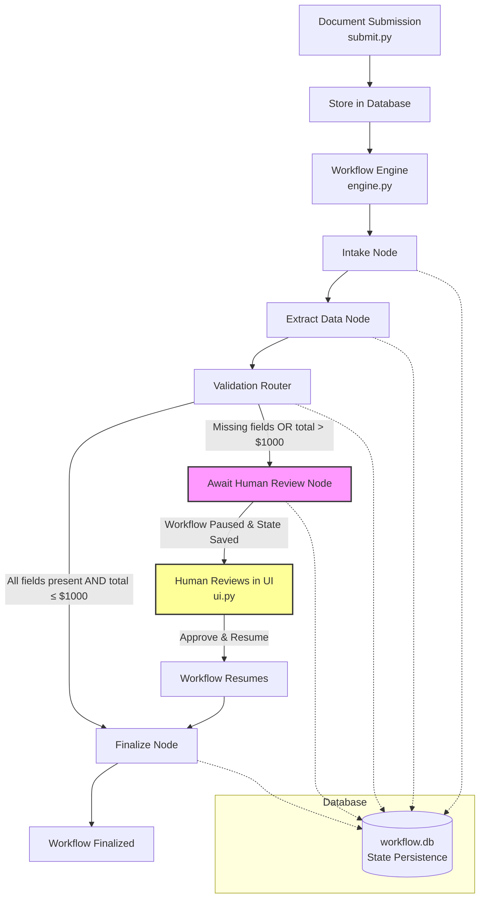
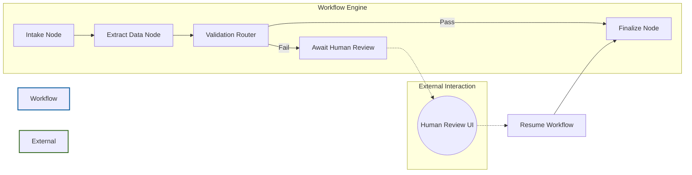
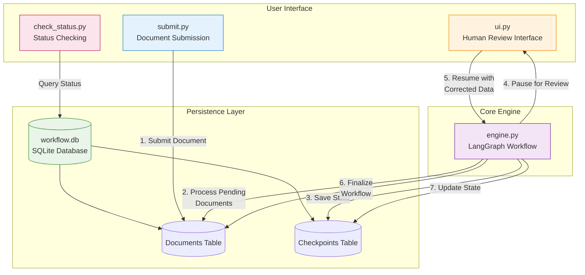

# Resilient AI Workflow Engine

A production-ready reference implementation for building resilient, enterprise-grade AI workflows using LangGraph with human-in-the-loop capabilities.

## Overview

This project demonstrates how to build a robust AI workflow engine that can handle long-running processes, recover from failures, and incorporate human review when needed. It's designed for mission-critical tasks where accuracy and reliability are paramount.

## Features

- **Stateful Workflows**: Built with LangGraph for robust state management
- **Persistent Checkpointing**: Automatic state persistence to SQLite database using SqliteSaver
- **Fault Tolerance**: Graceful recovery from system crashes
- **Human-in-the-Loop**: Streamlit UI for human review and approval
- **Modular Architecture**: Clean separation of concerns for easy maintenance

## System Architecture

```
┌─────────────────┐    ┌──────────────────┐    ┌─────────────────┐
│  submit.py      │    │   engine.py      │    │    ui.py        │
│ (Submission     │───▶│ (Workflow Engine)│◀──▶│ (Review UI)     │
│  Script)        │    │                  │    │                 │
└─────────────────┘    └──────────────────┘    └─────────────────┘
                                │
                                ▼
                        ┌─────────────────┐
                        │  workflow.db    │
                        │ (SQLite DB)     │
                        └─────────────────┘
```

## Prerequisites

- Python 3.8+
- OpenRouter API key (set as `OPENROUTER_API_KEY` environment variable)

## Installation

1. Clone the repository:
   ```bash
   git clone <repository-url>
   cd resilient-ai-workflow-engine
   ```

2. Create a virtual environment:
   ```bash
   python -m venv venv
   source venv/bin/activate  # On Windows: venv\Scripts\activate
   ```

3. Install dependencies:
   ```bash
   pip install -r requirements.txt
   ```

4. Set your OpenRouter API key:
   ```bash
   export OPENROUTER_API_KEY="your-api-key-here"
   ```
   On Windows:
   ```cmd
   set OPENROUTER_API_KEY=your-api-key-here
   ```

5. Optionally, specify which model to use (default is openai/gpt-3.5-turbo):
   ```bash
   export OPENROUTER_MODEL="anthropic/claude-3-haiku"
   ```

## Usage

### 1. Submit Documents

Submit documents for processing:
```bash
# Submit content directly
python submit.py --content "Sample invoice content here"

# Or submit content from a file
python submit.py --file path/to/document.txt
```

### 2. Run the Workflow Engine

Process submitted documents:
```bash
python engine.py
```

The engine will process all documents that have been submitted but not yet processed.

**Note**: The engine uses SqliteSaver for persistent checkpointing, which is implemented as a context manager. This ensures that workflow state is properly saved to the database after each step.

### 3. Check Document Status

Check the status of documents in the workflow:
```bash
# Check all documents
python check_status.py

# Check specific document
python check_status.py document-id-here
```

### 4. Review Documents (Human-in-the-Loop)

Start the Streamlit UI for human review:
```bash
streamlit run ui.py
```

Navigate to the provided URL in your browser to review and approve documents that require human validation.

## How It Works

1. **Document Submission**: Documents are submitted via the `submit.py` script which stores them in the database with a "received" status.

2. **Workflow Engine**: The `engine.py` script processes documents with "received" status by running them through the LangGraph workflow.

3. **Workflow Processing**: The workflow processes documents through a series of nodes:
   - Intake Node: Receives and initializes the document
   - Extract Data Node: Uses an LLM to extract structured data
   - Validation Router: Determines if human review is needed
   - Await Human Review Node: Pauses workflow for human intervention (if needed)
   - Finalize Node: Completes the workflow

4. **State Persistence**: After each step, the workflow state is saved to the database using LangGraph's SqliteSaver with proper context manager usage.

5. **Conditional Routing**: Documents are automatically routed based on business rules:
   - If all fields are extracted with high confidence and total amount < $1000, the workflow finalizes automatically
   - Otherwise, the workflow pauses for human review

6. **Human Review**: The Streamlit UI displays documents pending review, allowing users to correct data and approve/resume workflows.

7. **Fault Tolerance**: If the engine crashes, it can be restarted and will resume processing from the last saved checkpoint.

### End-to-End Workflow Diagram



### Detailed Node Interactions



### Complete System Architecture with Data Flow



## Project Structure

```
resilient-ai-workflow-engine/
├── engine.py           # Core workflow engine
├── submit.py           # Document submission script
├── ui.py               # Streamlit review interface
├── check_status.py     # Document status checking script
├── workflow.db         # SQLite database (created on first run)
├── requirements.txt    # Python dependencies
├── .env.example        # Environment variables template
├── README.md           # This file
└── sample_invoice.txt  # Sample document for testing
```

## Customization

To adapt this engine for your specific use case:

1. Modify the `DocumentState` schema in `engine.py` to match your document structure
2. Update the data extraction logic to reflect your needs
3. Adjust the business rules in `validation_router` function
4. Customize the Streamlit UI in `ui.py` for your review process

## Success Metrics

- **Time-to-Run**: Set up and run the entire workflow in under 20 minutes
- **Resilience**: Recover from engine crashes without losing workflow state
- **Clarity**: Understand core concepts through well-documented code
- **Extensibility**: Adapt the engine for new use cases with minimal changes

## Future Considerations

- API-driven architecture with FastAPI
- Alternative persistence backends (PostgreSQL, Redis)
- Docker containerization
- Integration with LangSmith for observability

## License

This project is open-source and available under the MIT License.