# Resilient AI Workflow Engine

A production-ready reference implementation for building resilient, enterprise-grade AI workflows using LangGraph. This project demonstrates how to architect stateful, asynchronous, and fault-tolerant systems with seamless "human-in-the-loop" (HITL) capabilities.

## 🎯 Overview

This is not another AI chatbot demo. It's a **production-ready pattern** for developers building mission-critical AI systems where accuracy, auditability, and recovery from failure are paramount.

### Key Features

- ✅ **Persistent Checkpointing**: SQLite-based state management that survives crashes
- 🔄 **Workflow Interruption & Resumption**: Seamless human-in-the-loop integration  
- 🛡️ **Fault Tolerance**: Complete workflow recovery after system restarts
- 🎛️ **Human Review Interface**: Streamlit-based UI for document validation
- 📊 **Structured Data Extraction**: LLM-powered document processing with validation
- 🏗️ **Modular Architecture**: Clean separation of concerns for easy extension

## 🚀 Quick Start

### Prerequisites

- Python 3.8+
- OpenRouter API key

### Installation

1. **Clone and setup**:
   ```bash
   git clone <repository-url>
   cd ai-workflow-engine
   pip install -r requirements.txt
   ```

2. **Configure API key**:
   ```bash
   cp .env.example .env
   # Edit .env and add your OPENROUTER_API_KEY
   ```

3. **Test the system**:
   ```bash
   python test_workflow.py
   ```

4. **Submit documents**:
   ```bash
   # Submit sample invoice
   python submit.py --sample
   
   # Submit custom content
   python submit.py "Invoice from Acme Corp for $500"
   
   # Submit from file
   python submit.py --file invoice.txt
   ```

5. **Review queue UI**:
   ```bash
   streamlit run ui.py
   ```

## 📋 Use Cases

### Invoice Processing
- **Automatic Approval**: Invoices under $1,000 with complete data
- **Human Review**: Large amounts, missing fields, or validation failures
- **Data Extraction**: Vendor name, invoice ID, due date, total amount

### Customer Support Tickets  
- **Automatic Routing**: Standard inquiries processed automatically
- **Escalation**: Irate customers or security issues flagged for review
- **Data Extraction**: Sentiment, topic, urgency, customer details

## 🏗️ Architecture & Flow Diagrams

### System Architecture Overview


### LangGraph Workflow Node Structure


### Data Flow & State Transitions

```mermaid
stateDiagram-v2
    [*] --> received : Document Submitted
    received --> processing : intake_node()
    processing --> processing : extract_data_node()
    
    processing --> pending_review : validation_router()<br/>❌ Fails validation
    processing --> finalized : validation_router()<br/>✅ Passes validation
    
    pending_review --> pending_review : Human reviewing<br/>in Streamlit UI
    pending_review --> processing : resume_workflow()<br/>with corrections
    
    finalized --> [*] : Workflow Complete
    
    note right of pending_review
        INTERRUPT POINT
        - System pauses execution
        - State persisted to SQLite
        - Human intervention required
        - Resume via UI approval
    end note
    
    note right of processing
        BUSINESS RULES
        • Amount > $1000 → Review
        • Missing required fields → Review  
        • Irate customer → Review
        • Security topics → Review
    end note
```



### End-to-End System Flow

```mermaid
sequenceDiagram
    participant User
    participant Submit as submit.py
    participant Engine as engine.py
    participant OpenRouter as OpenRouter API
    participant DB as workflow.db
    participant UI as ui.py (Streamlit)
    participant Human as Human Reviewer
    
    %% Document Submission Flow
    User->>Submit: python submit.py --file invoice.txt
    Submit->>Engine: run_workflow(content, doc_id)
    
    %% Initial Processing
    Engine->>DB: Save initial state (received)
    Engine->>Engine: intake_node() → status: processing
    Engine->>OpenRouter: Extract structured data from document
    OpenRouter-->>Engine: {vendor, invoice_id, amount, etc.}
    Engine->>DB: Update state with extracted_data
    
    %% Validation Decision
    Engine->>Engine: validation_router() checks business rules
    
    alt Amount < $1000 & Complete Data
        Engine->>Engine: finalize_node() → status: finalized
        Engine->>DB: Save final state
        Engine-->>Submit: Workflow complete
        Submit-->>User: ✅ Document processed automatically
    else Amount > $1000 OR Missing Data OR Security Issue
        Engine->>Engine: await_human_review_node()
        Engine->>DB: Set status: pending_review
        Engine->>Engine: INTERRUPT workflow
        Engine-->>Submit: Workflow paused for review
        Submit-->>User: ⚠️ Document requires human review
    end
    
    %% Human Review Process
    User->>UI: streamlit run ui.py
    UI->>DB: Query pending workflows
    DB-->>UI: List of documents needing review
    UI-->>Human: Display review queue
    
    Human->>UI: Select document for review
    UI->>DB: Get workflow details
    DB-->>UI: Document content + extracted data + reason
    UI-->>Human: Show document review interface
    
    Human->>UI: Edit data & click "Approve & Resume"
    UI->>Engine: resume_workflow(doc_id, corrected_data)
    
    %% Resume Processing
    Engine->>DB: Update state with corrections
    Engine->>Engine: validation_router() re-check rules
    
    alt Corrected Data Passes Validation
        Engine->>Engine: finalize_node() → status: finalized
        Engine->>DB: Save final state
        Engine-->>UI: Workflow completed
        UI-->>Human: ✅ Document approved & finalized
    else Still Fails Validation
        Engine->>Engine: await_human_review_node()
        Engine->>DB: Keep status: pending_review
        Engine-->>UI: Still needs review
        UI-->>Human: Document returned to queue
    end
```



### Component Interaction Details


### Components

1. **submit.py**: Command-line document submission script with file/sample support
2. **engine.py**: Core LangGraph workflow with OpenRouter integration and state management
3. **ui.py**: Streamlit interface for human review, editing, and workflow approval
4. **workflow.db**: SQLite database for persistent checkpointing and crash recovery

## 🔄 Workflow States

- **received**: Document submitted to system
- **processing**: AI extraction in progress  
- **pending_review**: Paused for human validation
- **finalized**: Processing completed successfully
- **error**: Unrecoverable processing error

## 🧪 Testing & Validation

The system includes comprehensive test scenarios:

```bash
python test_workflow.py
```

Tests cover:
- ✅ Automatic approval (small invoices)
- ⚠️ Human review triggers (large amounts, missing data)
- 🎭 Customer sentiment analysis (irate customers)
- 🔄 Workflow resumption after corrections
- 💾 Crash recovery simulation

## 🛡️ Resilience Features

### Crash Recovery
If the engine process crashes:
1. All workflow state persists in SQLite
2. Restart the engine with `python engine.py`
3. Use the UI to resume any pending workflows
4. No data or progress is lost

### Human Intervention
Documents requiring review are automatically paused:
- Missing or invalid data fields
- Business rule violations (amount thresholds)
- Sentiment analysis flags (irate customers)
- Security-related topics

### State Management
- Complete workflow history tracking
- Atomic state updates with rollback capability
- Thread-safe concurrent processing support
- Audit trail for compliance requirements

## 📊 Success Metrics

- **Time-to-Run**: Complete setup in under 20 minutes
- **Resilience**: Survives engine crashes with full recovery
- **Clarity**: Backend engineers can understand LangGraph concepts immediately  
- **Extensibility**: Easy to adapt for new use cases

## 🔮 Future Enhancements (V2)

- **API Layer**: FastAPI integration for service-oriented architecture
- **Database Options**: PostgreSQL, Redis backend support
- **Containerization**: Docker Compose for one-click deployment
- **Observability**: LangSmith integration for detailed tracing
- **Authentication**: User management and role-based access
- **Batch Processing**: Bulk document processing capabilities

## 🤝 Contributing

This project serves as a reference implementation and learning resource. Contributions that improve clarity, add test cases, or extend functionality are welcome.

## 📄 License

MIT License - see LICENSE file for details.

---

**Built with ❤️ to bridge the gap between AI demos and production systems.**